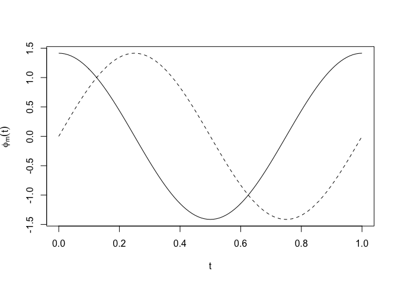
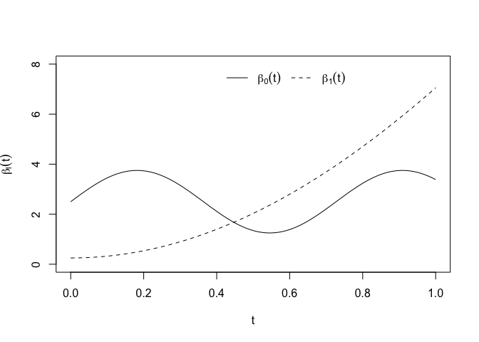
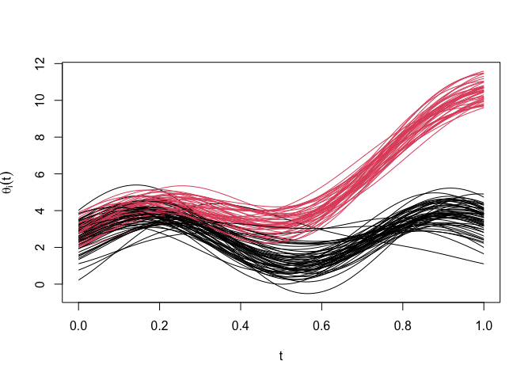
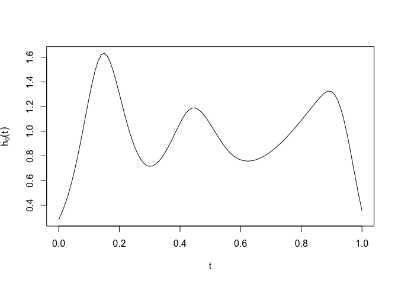
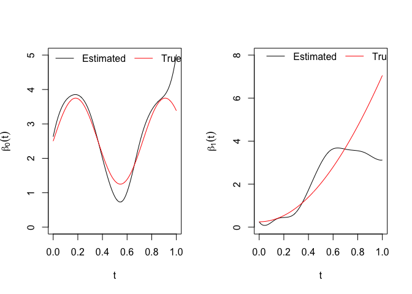

# FLTM-JM: Functional Latent Trait Model-Joint Modeling


# Introduction

FLTM-JM is a joint modeling framework for multivariate longitudinal
ordinal variables and time-to-event data with right censoring. A
Bayesian framework is utilized for parameter estimation and dynamic
prediction. The posterior sampling is done by *Stan* in *R*, utilizing
the package *rstan*. This vignette illustrates implementation of FLTM-JM
on a simulated data.

- Call necessary R packages

``` r
library(splines)
library(rstan)
library(parallel)
library(foreach)
library(tdROC)
library(survival)
```

- Settings for parallel execution of all Monte Carlo chains

``` r
rstan_options(auto_write = TRUE)
options(mc.cores = parallel::detectCores())
```

- We first generate survival data with right censoring. The process
  start with defining the true parameters

``` r
# Bspline on finite grid
time_grid<-seq(0,1,by=0.01)
bnd_knts<-c(0,1)
BS<-bs(time_grid, df = 10, intercept=TRUE, degree=3,Boundary.knots = bnd_knts)
knts<-attr(BS,"knots")
```

- A constant baseline hazard function over the functional domain

``` r
# constant baseline hazard
bh_coef<-0.5
bh_t<-rep(exp(bh_coef),length(time_grid))
```

- We consider a single covariate for Cox Proportion Hazard (CoxPH)
  model, which is genearted from *U(0,1)*.

``` r
N<-100 # sample size
Xpred<-cbind(runif(N,0,1)) # covariate for CoxPH model
```

- For subject-specific random deviation, \$U_i(t), in the latent trait
  $\theta_i(t)$ is defined by two orthogonal eigenfunctions, which we
  define by Fourier basis as follows.

``` r
# Eigenfunction
M<-2
psiFUN<-function(time){
  rbind(sqrt(2)*cos(2*pi*time),
        sqrt(2)*sin(2*time*pi))
}
plot(time_grid,psiFUN(time_grid)[1,],type="l",xlab=expression(t),ylab=expression(phi[m](t)))
lines(time_grid,psiFUN(time_grid)[2,],lty=2)
```



- We generate scores corresponding to the two eigenfunctions from
  $N(0,\sigma_1^2)$ and $N(0,\sigma_2^2)$ by setting $\sigma_1=0.2$ and
  $\sigma_2=0.1$

``` r
true_lmda<-c(0.2,0.1)
set.seed(125)
Zscr<-sapply(1:M,function(m){
  rnorm(N,0,sqrt(true_lmda[m]))
})
```

- We consider that the latent trait $\theta_i(t)$ depends on a baseline
  treatment information. The associated coeffcients are functions
  defined as follows.

``` r
treat_pts = rbinom(N,1,prob = 0.5)
Xdesign<-cbind(1,treat_pts)
betaFUN<-function(time){
  rbind(2.5+1.25*sin(2.75*time*pi) ,(12*time * sin(0.2*pi*time))+(0.25*cos(0.5*pi*time)))
}
plot(time_grid,betaFUN(time_grid)[1,],type="l",xlab=expression(t),ylab=expression(beta[l](t)),ylim=c(0,8))
lines(time_grid,betaFUN(time_grid)[2,],lty=2)
legend(x=0.4,y=8,legend = c(expression(beta[0](t)),expression(beta[1](t))),lty = c(1,2),bty="n",horiz=TRUE)
```



- Latent traits for all subjects

``` r
theta<-(Xdesign%*%betaFUN(time_grid))+(Zscr%*%psiFUN(time_grid))
matplot(time_grid,t(theta),type="l",lty=1,col=treat_pts+1,ylab=expression(theta[i](t)),xlab=expression(t))
```



- Function for survival data generation

``` r
event_time_coxPH<-function(bh_t,t_arg,int_wt,designM,beta_coef,theta,rho_par,delta=0.1,unif_par=c(0,1)){
  n<-nrow(designM)
  hFUN<-t(sapply(1:n, function(i){
    a<-sum(designM[i,]*beta_coef)+ (rho_par*theta[i,])
    Hz<-(bh_t*int_wt)*exp(a)
    exp(-cumsum(Hz))
  }))
  usam<-runif(n,unif_par[1],unif_par[2])
  ev_time<-t_arg[sapply(1:n, function(i){which(hFUN[i,]<usam[i])[1]})]
  ev_time[which(is.na(ev_time))]<-max(t_arg)+delta
  ev_time
}
```

``` r
gam_par<--1.10 # coefficient associated with survival covariate
rho_par<-0.20 # parameter associated with severity profiel theta_i(t) in the CoxPH model
qwt<-rep(time_grid[2]-time_grid[1],length(time_grid)) # weights for Reimann integral
sv_time<-event_time_coxPH(bh_t=bh_t,
                          t_arg = time_grid,
                          designM = Xpred,
                          beta_coef = gam_par,
                          theta = theta,
                          rho_par =  rho_par,
                          int_wt = qwt,
                          unif_par=c(0,0.9))

summary(sv_time) # summary of the event time
```

       Min. 1st Qu.  Median    Mean 3rd Qu.    Max. 
     0.0500  0.2075  0.3850  0.4787  0.7225  1.1000 

- Generation of censored time for all N subjects

``` r
cenT<-runif(N,0.1,10)
cen_status<-apply(cbind(sv_time,cenT),1,which.min)-1
mean(cen_status)
```

    [1] 0.09

``` r
cen_sub<-which(cen_status==1)

fsv_time<-apply(cbind(sv_time,cenT),1,min)

cen_indx<-which(fsv_time>1)

fsv_time[cen_indx]<-1
cen_status[cen_indx]<-1
mean(cen_status) # percentage of censoring
```

    [1] 0.17

``` r
summary(fsv_time) # summary of the observed time-to-event data
```

       Min. 1st Qu.  Median    Mean 3rd Qu.    Max. 
     0.0500  0.1975  0.3600  0.4428  0.6900  1.0000 

- Longitudinal data generation, considering 2 ordinal variables with 5
  five categories in each

``` r
ti_pos<-lapply(1:N, function(i){
  sort(sample(1:length(time_grid[time_grid<fsv_time[i]]),min(length(time_grid[time_grid<fsv_time[i]]),sample(3:8,1)),replace=FALSE))
})

m_i<-sapply(ti_pos, length)

subID<-rep(1:N,m_i)

theta_ij<-lapply(1:N,function(i){
  as.numeric(Xdesign[i,]%*%betaFUN(time_grid[ti_pos[[i]]]))+as.numeric(Zscr[i,]%*%psiFUN(time_grid[ti_pos[[i]]]))})

expit <- function(x) exp(x)/(1+exp(x))

K_ordi<-2
n_ordi<-rep(5,K_ordi)
a_ordi<-matrix(c(0,3.2,4.8,6.5,4.5,6.2,8.8,9.5),nrow=K_ordi,byrow = TRUE)
b_ordi<-c(1,2.25)

n_ordi<-rep(5,K_ordi)

y_val<-do.call(rbind,lapply(1:N,function(i){
  do.call(rbind,lapply(1:m_i[i], function(j){
    t(sapply(1:K_ordi,function(k){
      cm_prb<-c(expit(sapply(a_ordi[k,], function(u){u-b_ordi[k]*theta_ij[[i]][j]})),1)
      sample(1:n_ordi[k],1,prob = c(cm_prb[1],cm_prb[2:n_ordi[k]]-cm_prb[1:(n_ordi[k]-1)]))
    }))
  }))
}))
table(y_val[,1]) # summary of the fist ordinal variable
```


      1   2   3   4   5 
     14 229 166 108  40 

``` r
table(y_val[,2]) # summary of the second ordinal variable
```


      1   2   3   4   5 
     64  84 202  65 142 

- Neceassary quantities for posterior sampling using Stan.

``` r
# Basis for baseline hazard function at the observed survival time
#sur_basis=bs(fsv_time, knots = knts, intercept = TRUE, degree=3)
gridPOS<-sapply(fsv_time, function(x){
  which.min(sqrt((x-time_grid)^2))
})

# construction of peanlty matrix
D<-length(time_grid)
nu = .1
diff0 = diag(1, D, D)
diff2 = matrix(rep(c(1,-2,1, rep(0, D-2)), D-2)[1:((D-2)*D)], D-2, D, byrow = TRUE)
P0 = t(BS) %*% t(diff0) %*% diff0 %*% BS
P2 = t(BS) %*% t(diff2) %*% diff2 %*% BS
P.mat = nu * P0 + (1-nu) * P2
P.mat1 = solve(P.mat)
```

- Stan data object preparation

``` r
stan_dat<-list(N=N,
               P_surv = ncol(Xpred),
               W=Xpred,
               surv_time=fsv_time,
               status=1-cen_status,
               n_basis=ncol(BS),
               Tgrid=length(time_grid),
               BasisM=BS,
               TGpos=gridPOS,
               cHW=qwt,
               PenMat=P.mat1,
               obs=sum(m_i),
               subID=subID,
               longPOS=do.call(c,ti_pos),
               K_ordi=K_ordi,
               n_ordi=n_ordi,
               total_cat=sum(n_ordi),
               y_val=y_val,
               lt_cov=ncol(Xdesign),
               Xdesign=Xdesign,
               M=2)
```

- Initial value for the chains

``` r
# Initial values

inits01 <- list(gam_par=as.array(rep(0,ncol(Xpred))),
                bh_coef = rep(0.2,ncol(BS)),
                bh_sig=0.5,
                coef_par=matrix(0.5,nrow=M,ncol=ncol(BS)),
                coef_sig=array(rep(1,M)),
                rho_par=0.1,
                a_ordi_temp = as.array(rep(1,K_ordi-1)), 
                b_ordi_temp = as.array(rep(0.1,K_ordi-1)), 
                delta = rep(0.5,sum(n_ordi-1)-K_ordi),
                beta_par=matrix(rep(0.1,ncol(BS)*ncol(Xdesign)),ncol = ncol(BS)))

inits02 <- list(bh_coef = rep(-0.2,ncol(BS)),
                gam_par=as.array(rep(0.5,ncol(Xpred))),
                bh_sig=0.25,
                coef_par=matrix(1.5,nrow=M,ncol=ncol(BS)),
                coef_sig=array(rep(0.3,M)),
                rho_par=0.3,
                a_ordi_temp = as.array(rep(2,K_ordi-1)), 
                b_ordi_temp = as.array(rep(0.5,K_ordi-1)),
                delta = rep(0.15,sum(n_ordi-1)-K_ordi),
                beta_par=matrix(rep(1.1,ncol(BS)*ncol(Xdesign)),ncol = ncol(BS)))

# Specification of parameters

inits = list(c1 = inits01,c2=inits02)
```

- Specification of parameters

``` r
pars = c("bh_coef",
         "gam_par",
         "bh_sig",
         "coef_par",
         "coef_sig",
         "rho_par",
         "a_ordi",
         "b_ordi",
         "beta_par",
         "beta_sig",
         "lmd")
```

- Loading the stan model

``` r
stan_md<-stan_model("Stan_Models/model_fltjm.stan")
```

- Sampling from the posterior distribution

``` r
post_ss<-500
warm_ss<-300
compT<-NULL
pt1<-as.numeric(proc.time())[3]
stan_obj=sampling(object = stan_md,
                  data = stan_dat, 
                  iter = post_ss, 
                  warmup = warm_ss, 
                  chains = 2, 
                  thin=1, 
                  init = inits, 
                  pars = pars, 
                  control = list(adapt_delta = 0.8, max_treedepth=10),verbose=TRUE)
pt2<-as.numeric(proc.time())[3]
compT<-c(compT,pt2-pt1)
save(stan_obj,file="Results/stan_obj.RData")
```

``` r
load(file="Results/stan_obj.RData")
res_sum<-summary(stan_obj)$summary
```

``` r
res_sum
```

                            mean     se_mean          sd          2.5%
    bh_coef[1]     -1.255200e+00 0.076332319  0.95415673 -3.544505e+00
    bh_coef[2]     -4.383515e-01 0.056664809  0.66303025 -1.697521e+00
    bh_coef[3]      1.292060e+00 0.085457779  0.74749257 -2.510734e-02
    bh_coef[4]     -9.436551e-01 0.083743287  0.71075386 -2.415747e+00
    bh_coef[5]      5.781218e-01 0.084274137  0.65994589 -5.699581e-01
    bh_coef[6]     -4.151697e-01 0.085736114  0.69789223 -2.015873e+00
    bh_coef[7]     -1.849504e-01 0.082023932  0.67843281 -1.597892e+00
    bh_coef[8]      2.775896e-01 0.092009444  0.87494269 -1.504495e+00
    bh_coef[9]      4.030055e-01 0.103706895  0.95126431 -1.275854e+00
    bh_coef[10]    -1.033195e+00 0.137115099  1.24317198 -4.416132e+00
    gam_par[1]     -1.158721e+00 0.017539249  0.36313253 -1.833811e+00
    bh_sig          3.458674e-01 0.042392098  0.42386938  1.514216e-02
    coef_par[1,1]   3.161202e-03 0.097781830  0.37110249 -6.663906e-01
    coef_par[1,2]  -5.349931e-02 0.165522688  0.55498312 -1.062928e+00
    coef_par[1,3]  -2.780478e-02 0.070066357  0.34671535 -6.965088e-01
    coef_par[1,4]  -1.997933e-01 0.475592760  0.67057293 -1.356839e+00
    coef_par[1,5]   1.236642e-01 0.137934222  0.48715983 -7.469312e-01
    coef_par[1,6]   1.208320e-02 0.145373433  0.46434873 -9.272897e-01
    coef_par[1,7]   2.086381e-01 0.493070494  0.80598567 -1.401006e+00
    coef_par[1,8]   3.443761e-02 0.156145570  0.86799545 -1.762435e+00
    coef_par[1,9]  -4.731154e-01 0.635196042  1.65933177 -3.805259e+00
    coef_par[1,10]  8.874455e-02 0.171194364  0.82513174 -1.583712e+00
    coef_par[2,1]   2.222985e-01 0.088964422  0.30987992 -4.896802e-01
    coef_par[2,2]   4.133240e-01 0.219580601  0.57757327 -9.343723e-01
    coef_par[2,3]   1.675920e-01 0.043738618  0.32294392 -4.304704e-01
    coef_par[2,4]   1.055882e-02 0.289650776  0.77444790 -1.364786e+00
    coef_par[2,5]  -2.408248e-01 0.207588662  0.58316733 -1.245004e+00
    coef_par[2,6]  -1.508785e-01 0.052374407  0.45110489 -1.032583e+00
    coef_par[2,7]  -1.689542e-01 0.298700584  0.90682458 -1.929934e+00
    coef_par[2,8]   1.628593e-01 0.209240910  0.97613841 -1.499919e+00
    coef_par[2,9]   6.306709e-01 0.811274540  2.20597051 -4.284491e+00
    coef_par[2,10] -2.023652e-01 0.229808966  0.98356180 -1.990342e+00
    coef_sig[1]     2.448782e-01 0.066745661  0.27856360  1.025939e-02
    coef_sig[2]     3.273827e-01 0.034896584  0.27204293  4.378483e-02
    rho_par         2.498040e-01 0.003680056  0.05593005  1.340097e-01
    a_ordi[1]       0.000000e+00         NaN  0.00000000  0.000000e+00
    a_ordi[2]       3.177244e+00 0.021459355  0.23359188  2.745909e+00
    a_ordi[3]       4.767150e+00 0.026561174  0.26340418  4.246446e+00
    a_ordi[4]       6.484392e+00 0.029810653  0.32961931  5.932550e+00
    a_ordi[5]       4.762534e+00 0.067874024  0.90837673  3.242927e+00
    a_ordi[6]       6.376848e+00 0.069854832  0.93492817  4.843784e+00
    a_ordi[7]       9.062909e+00 0.074354597  0.99957654  7.416233e+00
    a_ordi[8]       9.850397e+00 0.075611596  1.01816043  8.196667e+00
    b_ordi[1]       1.000000e+00         NaN  0.00000000  1.000000e+00
    b_ordi[2]       2.300230e+00 0.023508613  0.28722040  1.815312e+00
    beta_par[1,1]   2.626743e+00 0.026889432  0.29569652  2.032909e+00
    beta_par[1,2]   3.462379e+00 0.025897038  0.35854998  2.812534e+00
    beta_par[1,3]   3.973467e+00 0.047135530  0.45334759  3.166498e+00
    beta_par[1,4]   3.783161e+00 0.037428036  0.40861931  3.014695e+00
    beta_par[1,5]   1.466503e+00 0.047468539  0.50237100  5.243575e-01
    beta_par[1,6]   9.103458e-02 0.055419524  0.67853412 -1.217534e+00
    beta_par[1,7]   2.953983e+00 0.079826743  0.82274174  1.525509e+00
    beta_par[1,8]   3.784172e+00 0.092190010  0.98166630  1.942690e+00
    beta_par[1,9]   3.875367e+00 0.143405652  1.51300722  9.816240e-01
    beta_par[1,10]  5.017645e+00 0.098231509  1.37506492  2.339249e+00
    beta_par[2,1]   2.426502e-01 0.015609058  0.29165881 -3.366884e-01
    beta_par[2,2]  -1.405381e-01 0.031244827  0.42182217 -9.231942e-01
    beta_par[2,3]   6.553642e-01 0.041870163  0.46645540 -2.942450e-01
    beta_par[2,4]   2.223217e-01 0.063770972  0.56767337 -7.638680e-01
    beta_par[2,5]   2.112670e+00 0.063841826  0.61647610  9.211946e-01
    beta_par[2,6]   3.891719e+00 0.089042720  0.90188705  2.266341e+00
    beta_par[2,7]   3.539698e+00 0.108465399  1.20399778  1.145310e+00
    beta_par[2,8]   3.603758e+00 0.205016489  1.97511050 -8.490816e-02
    beta_par[2,9]   3.082356e+00 0.293706472  3.19366880 -3.645974e+00
    beta_par[2,10]  3.120303e+00 0.241777809  3.67820955 -3.136971e+00
    beta_sig[1]     1.220729e+01 0.448118122  7.83287249  4.364627e+00
    beta_sig[2]     8.684886e+00 0.320807912  5.34690005  2.857484e+00
    lmd[1]          5.758630e+00 0.138737187  1.31749698  3.641199e+00
    lmd[2]          2.870316e+00 0.208823017  1.03915331  8.026722e-01
    lp__           -1.496225e+03 1.974802978 15.82968737 -1.528062e+03
                             25%           50%           75%         97.5%
    bh_coef[1]     -1.771779e+00 -1.132024e+00 -5.830319e-01     0.2712860
    bh_coef[2]     -8.446270e-01 -4.389895e-01 -3.936572e-03     0.8191226
    bh_coef[3]      7.630328e-01  1.301594e+00  1.787334e+00     2.6281241
    bh_coef[4]     -1.384068e+00 -8.839124e-01 -4.281316e-01     0.2262617
    bh_coef[5]      1.369490e-01  5.075830e-01  1.005007e+00     2.0337969
    bh_coef[6]     -8.533918e-01 -3.714015e-01  2.311321e-02     0.8537345
    bh_coef[7]     -5.883071e-01 -1.636554e-01  2.919869e-01     1.0480680
    bh_coef[8]     -3.064658e-01  3.147673e-01  8.167010e-01     2.0273356
    bh_coef[9]     -2.299206e-01  2.704804e-01  9.826816e-01     2.4484870
    bh_coef[10]    -1.586514e+00 -7.633902e-01 -1.393616e-01     0.6620426
    gam_par[1]     -1.398313e+00 -1.154343e+00 -9.013386e-01    -0.5046915
    bh_sig          1.188429e-01  2.324095e-01  4.140913e-01     1.2384152
    coef_par[1,1]  -2.741400e-01 -2.781637e-02  3.146363e-01     0.7196887
    coef_par[1,2]  -4.944419e-01 -4.007663e-02  3.590347e-01     1.0063327
    coef_par[1,3]  -2.976863e-01 -3.301633e-02  2.147118e-01     0.6594944
    coef_par[1,4]  -7.052964e-01 -2.916756e-01  3.040818e-01     1.1697211
    coef_par[1,5]  -2.033158e-01  9.614715e-02  4.588693e-01     1.1095867
    coef_par[1,6]  -2.927749e-01 -1.432603e-03  3.194208e-01     0.9080971
    coef_par[1,7]  -3.306364e-01  2.122736e-01  7.307718e-01     1.8129586
    coef_par[1,8]  -4.702628e-01  9.964354e-03  5.468708e-01     1.7928208
    coef_par[1,9]  -1.652205e+00 -2.632991e-01  6.187705e-01     2.6771429
    coef_par[1,10] -3.937352e-01  5.488942e-02  6.101552e-01     1.7840161
    coef_par[2,1]   5.438367e-02  2.795910e-01  4.177810e-01     0.7309281
    coef_par[2,2]   1.872367e-01  5.380417e-01  7.908364e-01     1.2662318
    coef_par[2,3]  -3.205792e-02  1.462889e-01  3.664226e-01     0.7839020
    coef_par[2,4]  -6.008835e-01 -6.471379e-03  6.675526e-01     1.3119415
    coef_par[2,5]  -6.394950e-01 -3.005564e-01  1.486155e-01     1.0880562
    coef_par[2,6]  -4.537248e-01 -1.520393e-01  1.103895e-01     0.7720411
    coef_par[2,7]  -8.201336e-01 -1.528953e-01  4.791180e-01     1.4481645
    coef_par[2,8]  -4.992065e-01  1.079200e-01  8.208786e-01     2.1695169
    coef_par[2,9]  -5.387732e-01  1.121680e+00  2.341749e+00     3.5961513
    coef_par[2,10] -8.481501e-01 -2.510153e-01  3.899900e-01     1.9280762
    coef_sig[1]     7.076881e-02  1.537000e-01  3.205508e-01     0.8556958
    coef_sig[2]     1.418663e-01  2.507374e-01  4.437562e-01     0.8678147
    rho_par         2.132851e-01  2.508910e-01  2.857473e-01     0.3613485
    a_ordi[1]       0.000000e+00  0.000000e+00  0.000000e+00     0.0000000
    a_ordi[2]       3.013680e+00  3.157996e+00  3.354125e+00     3.6201088
    a_ordi[3]       4.590000e+00  4.748088e+00  4.929083e+00     5.3206080
    a_ordi[4]       6.247831e+00  6.469972e+00  6.689838e+00     7.1612552
    a_ordi[5]       4.094644e+00  4.711967e+00  5.353617e+00     6.7131738
    a_ordi[6]       5.697782e+00  6.272951e+00  6.944598e+00     8.4142932
    a_ordi[7]       8.320352e+00  8.949909e+00  9.714159e+00    11.1397253
    a_ordi[8]       9.107448e+00  9.749653e+00  1.049361e+01    11.9662520
    b_ordi[1]       1.000000e+00  1.000000e+00  1.000000e+00     1.0000000
    b_ordi[2]       2.089951e+00  2.283011e+00  2.476379e+00     2.9064790
    beta_par[1,1]   2.418962e+00  2.612714e+00  2.830166e+00     3.2065797
    beta_par[1,2]   3.193639e+00  3.462858e+00  3.706205e+00     4.1937113
    beta_par[1,3]   3.678736e+00  3.972929e+00  4.267229e+00     4.8612845
    beta_par[1,4]   3.502794e+00  3.750352e+00  4.066192e+00     4.6611038
    beta_par[1,5]   1.120107e+00  1.464426e+00  1.782440e+00     2.5126331
    beta_par[1,6]  -3.601500e-01  7.978585e-02  5.512544e-01     1.4467694
    beta_par[1,7]   2.405171e+00  2.943439e+00  3.562619e+00     4.5492347
    beta_par[1,8]   3.141940e+00  3.814722e+00  4.434946e+00     5.8071703
    beta_par[1,9]   2.849929e+00  3.831892e+00  4.787829e+00     7.2232405
    beta_par[1,10]  4.157988e+00  4.983388e+00  5.863553e+00     7.7842332
    beta_par[2,1]   5.263376e-02  2.454996e-01  4.384526e-01     0.8257292
    beta_par[2,2]  -4.295563e-01 -1.382397e-01  1.455769e-01     0.6865316
    beta_par[2,3]   3.305125e-01  6.465629e-01  9.726332e-01     1.5357196
    beta_par[2,4]  -1.919051e-01  2.291086e-01  6.228564e-01     1.3015808
    beta_par[2,5]   1.673726e+00  2.095116e+00  2.553356e+00     3.3082753
    beta_par[2,6]   3.264778e+00  3.854060e+00  4.484038e+00     5.7374189
    beta_par[2,7]   2.686278e+00  3.532241e+00  4.388082e+00     5.8217854
    beta_par[2,8]   2.210976e+00  3.611319e+00  4.930509e+00     7.5524508
    beta_par[2,9]   8.685096e-01  3.213859e+00  5.270373e+00     8.8421525
    beta_par[2,10]  5.607996e-01  2.698670e+00  5.100983e+00    11.7121923
    beta_sig[1]     6.848300e+00  1.010091e+01  1.506037e+01    30.9107474
    beta_sig[2]     5.544279e+00  7.485476e+00  1.002672e+01    21.7437561
    lmd[1]          4.855751e+00  5.600178e+00  6.622291e+00     8.4834128
    lmd[2]          2.161485e+00  2.853089e+00  3.591580e+00     4.8396943
    lp__           -1.505402e+03 -1.495748e+03 -1.485255e+03 -1466.2517509
                        n_eff      Rhat
    bh_coef[1]     156.250898 1.0060963
    bh_coef[2]     136.911469 1.0099249
    bh_coef[3]      76.508653 1.0294289
    bh_coef[4]      72.034152 1.0222452
    bh_coef[5]      61.323655 1.0209720
    bh_coef[6]      66.259651 1.0103789
    bh_coef[7]      68.412036 1.0069708
    bh_coef[8]      90.426225 1.0072726
    bh_coef[9]      84.137023 1.0002394
    bh_coef[10]     82.203794 1.0073039
    gam_par[1]     428.655424 0.9957866
    bh_sig          99.975659 1.0197325
    coef_par[1,1]   14.403612 1.0993097
    coef_par[1,2]   11.242023 1.2715162
    coef_par[1,3]   24.486520 1.0939480
    coef_par[1,4]    1.988024 1.4752285
    coef_par[1,5]   12.473803 1.2145965
    coef_par[1,6]   10.202778 1.0968924
    coef_par[1,7]    2.672001 1.4517758
    coef_par[1,8]   30.901216 1.0481373
    coef_par[1,9]    6.824187 1.3629882
    coef_par[1,10]  23.230987 1.1146288
    coef_par[2,1]   12.132608 1.1798645
    coef_par[2,2]    6.918728 1.4160691
    coef_par[2,3]   54.516015 1.0375860
    coef_par[2,4]    7.148831 1.4883664
    coef_par[2,5]    7.891855 1.3258372
    coef_par[2,6]   74.185127 1.0747798
    coef_par[2,7]    9.216678 1.3450656
    coef_par[2,8]   21.763543 1.1449496
    coef_par[2,9]    7.393732 1.4361679
    coef_par[2,10]  18.317634 1.1329335
    coef_sig[1]     17.418175 1.1648821
    coef_sig[2]     60.772776 1.0723300
    rho_par        230.983872 0.9976131
    a_ordi[1]             NaN       NaN
    a_ordi[2]      118.490126 1.0133733
    a_ordi[3]       98.344663 1.0241842
    a_ordi[4]      122.259413 1.0168245
    a_ordi[5]      179.112051 0.9964136
    a_ordi[6]      179.128043 0.9954473
    a_ordi[7]      180.724260 0.9952681
    a_ordi[8]      181.324139 0.9953591
    b_ordi[1]             NaN       NaN
    b_ordi[2]      149.271384 1.0023038
    beta_par[1,1]  120.928639 1.0162369
    beta_par[1,2]  191.689893 0.9976319
    beta_par[1,3]   92.505136 1.0196046
    beta_par[1,4]  119.191065 0.9963947
    beta_par[1,5]  112.004994 1.0069645
    beta_par[1,6]  149.905578 0.9992360
    beta_par[1,7]  106.225855 0.9995612
    beta_par[1,8]  113.386158 1.0041532
    beta_par[1,9]  111.313917 0.9999261
    beta_par[1,10] 195.949778 1.0086365
    beta_par[2,1]  349.137749 0.9994888
    beta_par[2,2]  182.264701 1.0013417
    beta_par[2,3]  124.111191 1.0130335
    beta_par[2,4]   79.241186 1.0026031
    beta_par[2,5]   93.244212 0.9981201
    beta_par[2,6]  102.590574 1.0063343
    beta_par[2,7]  123.216519 1.0061057
    beta_par[2,8]   92.812231 1.0021564
    beta_par[2,9]  118.236814 1.0063457
    beta_par[2,10] 231.440873 1.0066584
    beta_sig[1]    305.532279 0.9996188
    beta_sig[2]    277.788326 1.0005416
    lmd[1]          90.180676 1.0142955
    lmd[2]          24.762958 1.1092320
    lp__            64.253550 1.0246927

- Estimated eigenfunctions, $\widehat{\phi}_m(\cdot)$

``` r
cfP<-rstan::extract(stan_obj,pars=c("coef_par"))$coef_par
cfM<-t(sapply(1:dim(cfP)[2], function(k){colMeans(cfP[,k,])}))
egF<-svd(t(BS%*%t(cfM)))$v
par(mfrow=c(1,2))
plot(time_grid,egF[,1]*sqrt(length(time_grid)),type="l",ylim=c(-2,2),ylab=expression(hat(phi)[1](t)),xlab=expression(t))
lines(time_grid,psiFUN(time_grid)[1,],col="red")
plot(time_grid,egF[,2]*sqrt(length(time_grid)),type="l",ylim=c(-2,2),ylab=expression(hat(phi)[2](t)),xlab=expression(t))
lines(time_grid,-psiFUN(time_grid)[2,],col="red") # unique upto a sign change
```


``` r
est_rho<-mean(rstan::extract(stan_obj,pars=c('rho_par'))$rho_par)
est_rho # estimated rho parameters
```

    [1] 0.249804

``` r
est_gam<-mean(rstan::extract(stan_obj,pars=c('gam_par'))$gam_par)
est_gam # estimated gamma parameters
```

    [1] -1.158721

``` r
est_bh<-as.numeric(exp(BS%*%matrix(res_sum[1:10,1])))
plot(time_grid,est_bh,type="l",ylab=expression(hat(h)[0](t)),xlab=expression(t)) # estimated baseline 
```



``` r
est_beta<-colMeans(rstan::extract(stan_obj,pars=c('beta_par'))$beta_par)
par(mfrow=c(1,2))
plot(time_grid,(BS%*%t(est_beta))[,1],type="l",ylim=c(0,5),ylab=expression(beta[0](t)),xlab=expression(t))
lines(time_grid,betaFUN(time=time_grid)[1,],col="red")
legend(x=-0.05,y=5.25,legend = c("Estimated","True"),lty=c(1,1),col=c("black","red"),bty="n",horiz=TRUE)
plot(time_grid,(BS%*%t(est_beta))[,2],type="l",ylim=c(0,8),ylab=expression(beta[1](t)),xlab=expression(t))
lines(time_grid,betaFUN(time=time_grid)[2,],col="red")
legend(x=-0.01,y=8.5,legend = c("Estimated","True"),lty=c(1,1),col=c("black","red"),bty="n",horiz=TRUE)
```


